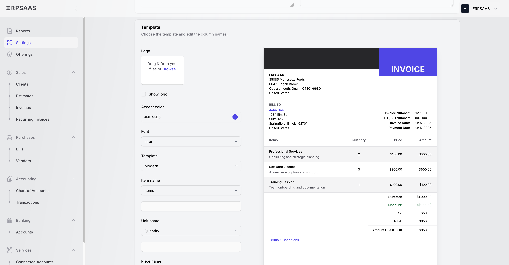
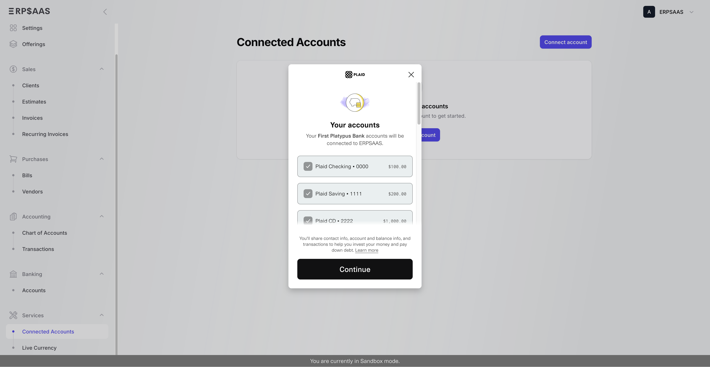
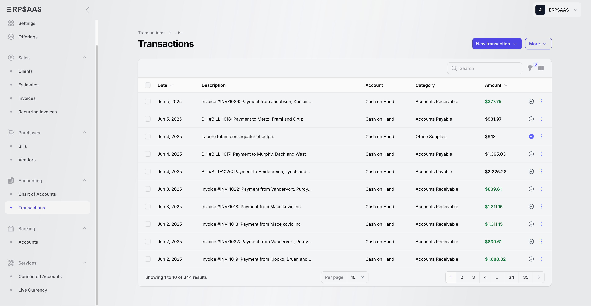
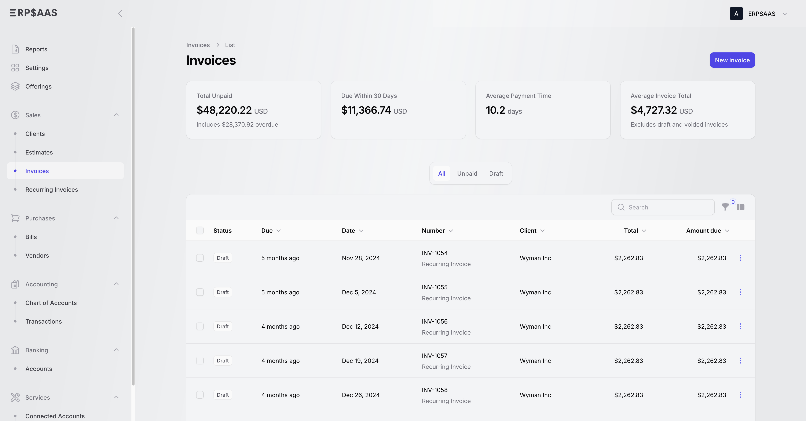
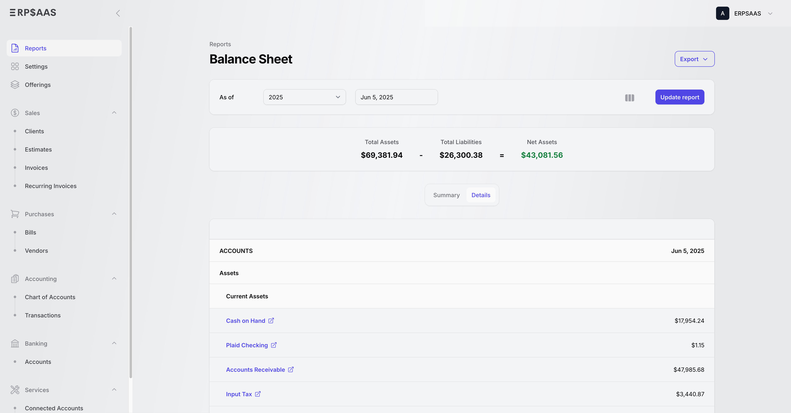
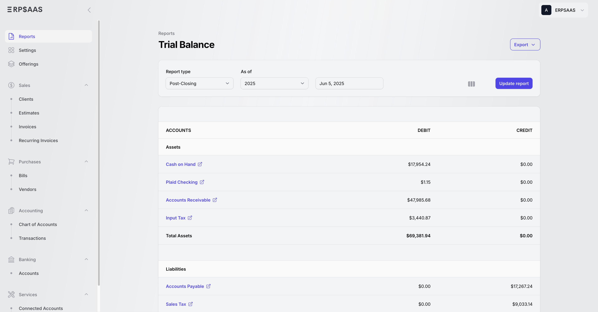
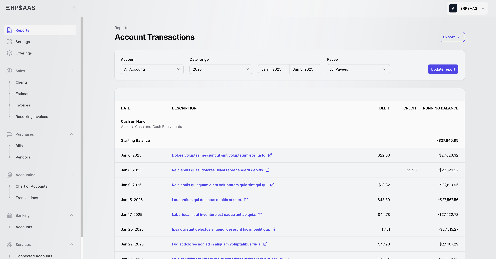
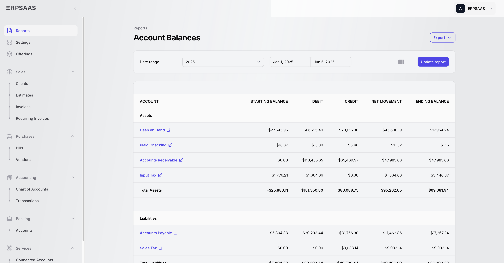

# NL-FinancePro - Advanced Accounting Portfolio (Netherlands & IFRS Focused)

[](https://opensource.org/licenses/MIT)
[Repository: hrahm/nl-financepro](https://github.com/hrahm/nl-financepro)

## Project Overview

This project is a customized version of the [ERPSaaS](https://github.com/andrewdwallo/erpsaas) platform, specifically enhanced to demonstrate technical proficiency in **Laravel/PHP** development combined with deep **domain expertise in General Ledger Accounting and Financial Analysis** within the Netherlands market.

As a General Ledger Accountant and Financial Analyst with 5 years of experience, I have adapted this platform to meet **IFRS (International Financial Reporting Standards)** and Dutch-specific regulatory requirements (BTW/Taxation).

### 🚀 Key Portfolio Highlights

*   **IFRS Component**: Re-engineered the financial statement engine to support IFRS-compliant reporting (Current vs. Non-current classification).
*   **Netherlands Localization**: Integrated full Dutch language support with professional accounting terminology and local fiscal standards.
*   **Fiscal Compliance**: Implemented Dutch BTW (VAT) handling logic (21%, 9%, 0%) with recoverable/non-recoverable tax tracking.
*   **Banking & Payments**: Integration-ready architecture for SEPA and CAMT.053 standards (common in Dutch banking).
*   **Technical Stack**: Laravel 11, Filament PHP (TALL Stack), MySQL, and Tailwind CSS.

---

## 📸 Screenshots

### Invoice Management


### Connected Accounts & Banking


### Transaction Overview


### Invoices List


### IFRS Balance Sheet


### Trial Balance Report


### Account Transactions


### Account Balances


---

## 🇳🇱 Netherlands-Specific Features

### Professional Localization
- **Dutch Language Support**: Complete translation of the UI using standard Dutch accounting terms (e.g., *Grootboekrekening*, *VOF/BV* legal structures, *Offertes*).
- **EUR Default**: Pre-configured for Euro (€) with European number formatting (`1.234,56`).
- **BTW Handling**: Automated tax categories for high/low/zero rates, including *Voorbelasting* (input tax) recovery logic.

### IFRS Financial Statements
Enhanced reporting modules to generate:
1.  **IFRS Balance Sheet**: Explicit grouping of assets and liabilities into Current and Non-current categories.
2.  **Multi-step Income Statement**: Clear distinction between operating and non-operating results.
3.  **Indirect Cash Flow Statement**: Automated tracking of cash movements.

---

## 🛠️ Installation & Setup

### Prerequisites
- PHP 8.2 or higher
- Composer
- Node.js & NPM
- MySQL or SQLite

### Steps
1.  **Clone & Install**:
    ```bash
    git clone https://github.com/hrahm/nl-financepro.git
    cd nl-financepro
    composer install
    npm install
    ```
2.  **Environment Setup**:
    ```bash
    cp .env.example .env
    php artisan key:generate
    ```
3.  **Database & Seeders**:
    ```bash
    php artisan migrate
    # Run the specialized Netherlands seeder
    php artisan db:seed --class=NetherlandsAccountingSeeder
    ```
4.  **Run Development Server**:
    ```bash
    npm run dev
    php artisan serve
    ```

---

## 📜 Attribution & License

This project is forked from the excellent [ERPSaaS](https://github.com/andrewdwallo/erpsaas) project by [Andrew Wallo](https://github.com/andrewdwallo). 

- **Original Project**: [andrewdwallo/erpsaas](https://github.com/andrewdwallo/erpsaas)
- **License**: MIT License (See [LICENSE](LICENSE) file).

### Modifications Made for Portfolio
A detailed list of changes can be found in the [CHANGELOG.md](CHANGELOG.md). Major modifications include:
- Custom report transformers for IFRS compliance.
- Improved Dutch translation files (`nl.json`).
- Custom `NetherlandsAccountingSeeder` for local fiscal setup.
- Financial KPI dashboard refinements.

---

## 👨‍💼 Contact & Portfolio

Developed by a **General Ledger Accountant & Financial Analyst** seeking opportunities in the Netherlands.

- **LinkedIn**: [[Your Profile Link](https://www.linkedin.com/in/hamerhn)]
- **Technical Skills**: Financial Reporting (IFRS/Dutch GAAP), Laravel, SQL, Audit Compliance.
- **Accounting Expertise**: Month-end closing, VAT filings (BTW), Financial Statement Analysis, ERP Implementation.
